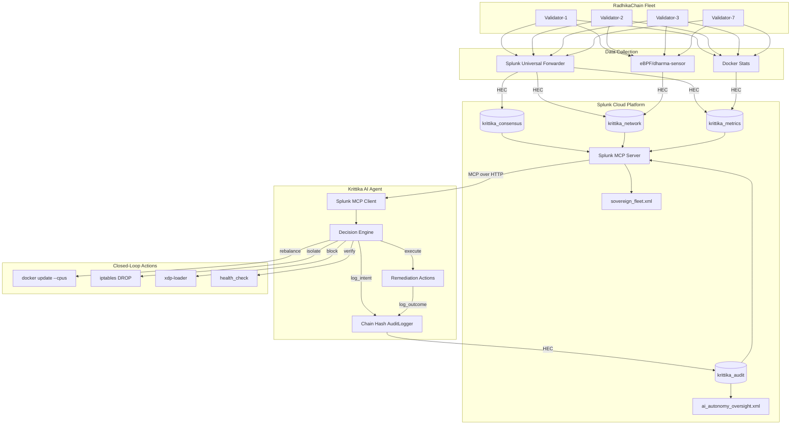

# Krittika-Splunk Nexus Architecture

## System Overview

## Data Flow

1. **Ingest**: Validators emit consensus logs, eBPF sensors capture network events, Docker reports resource metrics
2. **Index**: Splunk Universal Forwarder sends all data to Splunk Cloud via HEC
3. **Query**: AI Agent queries Splunk via MCP Server (`splunk_run_query`)
4. **Decide**: Decision Engine classifies anomaly (security vs. resource)
5. **Audit**: Chain Hash AuditLogger records intent (pre-execution)
6. **Act**: Remediation Actions execute (docker/iptables/xdp)
7. **Verify**: Post-action health check confirms effectiveness
8. **Audit**: Chain Hash AuditLogger records outcome (post-execution)
9. **Visualize**: Dashboards display operational state and audit trail

## Security Model

- **HEC Token**: Write-only access to `krittika_audit` index
- **MCP Token**: Encrypted, role-based (`mcp_tool_execute` capability)
- **Chain Hash**: SHA-256 linked entries — tampering breaks the chain
- **Session ID**: Groups related decisions for forensic reconstruction
- **RBAC**: Agent cannot delete or modify audit entries
